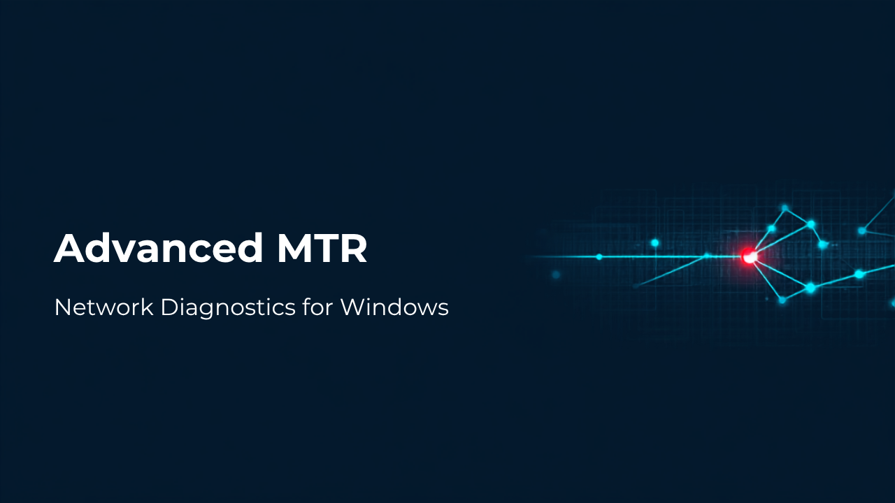

# Advanced MTR



**Advanced MTR** is a modern network diagnostic tool for **Windows 11**,
inspired by the classic [mtr](https://github.com/traviscross/mtr). It
combines *traceroute* and *ping* into one live view: every router (hop)
between you and a destination is probed continuously, so you can see
exactly **where** on the path packets are being delayed or lost.

## Features

- **Simple input** — type a destination IP address or hostname and press
  Start. IPv4 and IPv6 are both supported.
- **Live per-hop statistics** — Loss %, Sent/Received, Last / Avg / Best /
  Worst RTT, standard deviation and jitter, just like classic mtr.
- **Packet-loss auto-highlight** — any hop losing more than 0% of probes is
  automatically tinted (amber for light loss, red for heavy loss) so
  problems jump out instantly.
- **Graphical path view** — the full route is drawn as a chain of nodes
  showing every IP address in the path, coloured by health, with hostname
  and location labels. Exportable as a PNG image.
- **Latency sparklines** — a live mini-chart of recent RTTs per hop, with
  red ticks marking lost probes.
- **Hostname, location & network owner** — reverse DNS plus GeoIP/ASN
  lookup (via ip-api.com) label each hop with who operates it and where
  it is.
- **Packet-loss alerts** — keep it running in the background; a Windows
  tray notification fires when any hop's loss crosses your threshold.
- **Export** — save results as **CSV**, **TXT** (classic mtr report
  layout) or **Markdown** (lossy hops flagged automatically).
- **Pause / Resume / Reset**, configurable probe interval, timeout,
  packet size and hop limit, dark & light themes.

## Why no Administrator rights?

Advanced MTR uses the Windows IP Helper API (`IcmpSendEcho`), the same
mechanism as the built-in `ping`, so it does **not** need Administrator
privileges or WinPcap/Npcap drivers.

## Installation

Download **`AdvancedMTR-Setup-<version>.exe`** from the
[Releases](https://github.com/shamim316/mtr-advanced/releases) page and run
it. The installer is a single file with **all dependencies included** — no
Python, no extra runtimes. A portable single-file `AdvancedMTR.exe` is also
published for use without installation.

Installers are produced automatically by the
[GitHub Actions build](.github/workflows/build.yml) (PyInstaller +
Inno Setup) on every tagged release, and as downloadable artifacts on every
build.

## Running from source

```bash
pip install -r requirements.txt
python -m mtr_advanced          # optionally: python -m mtr_advanced 8.8.8.8
```

Note: on Linux/macOS the fallback probe engine uses raw sockets and needs
root; the primary target platform is Windows 10/11.

## Reading the results

- **Loss at one middle hop only** (later hops clean): that router is just
  rate-limiting its TTL-expired replies — usually harmless.
- **Loss starting at a hop and continuing to the destination**: real
  packet loss beginning at that hop; that's where the problem is.
- **`No response` hops**: routers that silently drop probe replies; only a
  concern if loss also appears downstream.

## Development

```bash
pip install -r requirements.txt pytest
pytest tests/ -v
```

Project layout:

| Path | Purpose |
| --- | --- |
| `mtr_advanced/core/` | Probe engine (Windows IP Helper API / POSIX raw sockets), stats, tracer loop, DNS + GeoIP enrichment |
| `mtr_advanced/gui/` | PyQt6 GUI: hop table, sparklines, path diagram, theming |
| `mtr_advanced/export/` | CSV / TXT / Markdown exporters |
| `installer/` | Inno Setup script + Windows version resource |
| `.github/workflows/` | CI: tests + Windows installer build |

## License

[MIT](LICENSE). Inspired by (but not derived from)
[mtr](https://github.com/traviscross/mtr) by Matt Kimball, Roger Wolff and
contributors. Icon and thumbnail created with Canva.
